# 1869AC

**1869AC** is an animated, terminal-based music player built in Python. Powered by `libvlc` and `pygame.mixer`, it features multi-playlist support, multiple folder importing, volume controls, shuffle queueing, and a custom ANSI terminal interface with UI sound effects.

**_Just made a new website for our app rn it is just a simple website for our app later it is gonna become a user dashboard for the online mode/version of our app._**

_In the future it will also be online! At this website: https://www.thepillu.site/. Then it will be available both online and offline!_

These are also work in progress features!: Preset Themes, Help Box, Speed Control, aur Custom Colors these are not working 

## Architecture Diagram

```mermaid
flowchart TD

subgraph group_terminal["Terminal Player"]
  node_entry["Player Startup<br/>[main.py]"]
  node_controls["Playback UI<br/>[widgets.py]"]
  node_audio["VLC Playback"]
end

subgraph group_library["Playlist Library"]
  node_importer["Folder Importer<br/>[import_system.py]"]
  node_playlists["Playlist Definitions<br/>[songs_path.py]"]
end

subgraph group_accounts["Accounts and Cloud"]
  node_account["Account Access<br/>[auth.py]"]
  node_supaclient["Supabase Client<br/>[supabaseclient.py]"]
end

subgraph group_website["Web Experience"]
  node_webapp["Web Router<br/>[App.jsx]"]
  node_home["Home Page<br/>[home.jsx]"]
  node_features["Feature Page<br/>[features.jsx]"]
  node_animation["Home Animation<br/>[animation.jsx]"]
  node_ascii["ASCII Animation"]
  node_navbar["Navigation Bar<br/>[navbar.jsx]"]
  node_login["Login Page<br/>[login.jsx]"]
  node_protected["Route Guard<br/>[protected.jsx]"]
  node_dashboard["Dashboard<br/>[dashboard.jsx]"]
  node_webstate["Login State<br/>[data.jsx]"]
end

node_user(("Listener"))
node_cloud[("Supabase Service")]

node_user -->|"starts"| node_entry
node_entry -->|"offers access"| node_account
node_account -->|"authenticates via"| node_supaclient
node_supaclient -->|"connects"| node_cloud
node_entry -->|"syncs playlists"| node_cloud
node_entry -->|"imports folders"| node_importer
node_entry -->|"loads playlists"| node_playlists
node_importer -->|"appends playlists"| node_playlists
node_entry -->|"starts controls"| node_controls
node_controls -->|"imports folders"| node_importer
node_controls -->|"reads playlists"| node_playlists
node_entry -->|"starts playback"| node_audio
node_controls -->|"controls playback"| node_audio
node_user -->|"browses"| node_webapp
node_webapp -->|"routes to"| node_home
node_webapp -->|"routes to"| node_features
node_webapp -->|"routes to"| node_login
node_webapp -->|"guards dashboard"| node_protected
node_protected -->|"renders when allowed"| node_dashboard
node_home -->|"renders"| node_animation
node_animation -->|"uses"| node_ascii
node_webapp -->|"renders"| node_navbar
node_login -->|"updates state"| node_webstate
node_protected -->|"checks state"| node_webstate
node_navbar -->|"checks state"| node_webstate

click node_entry "https://github.com/mrpeng4/1869ac/blob/main/main.py"
click node_controls "https://github.com/mrpeng4/1869ac/blob/main/widgets.py"
click node_importer "https://github.com/mrpeng4/1869ac/blob/main/import_system.py"
click node_playlists "https://github.com/mrpeng4/1869ac/blob/main/songs_path.py"
click node_account "https://github.com/mrpeng4/1869ac/blob/main/auth.py"
click node_supaclient "https://github.com/mrpeng4/1869ac/blob/main/supabaseclient.py"
click node_webapp "https://github.com/mrpeng4/1869ac/blob/main/react-stuff/src/App.jsx"
click node_home "https://github.com/mrpeng4/1869ac/blob/main/react-stuff/src/home.jsx"
click node_features "https://github.com/mrpeng4/1869ac/blob/main/react-stuff/src/features.jsx"
click node_animation "https://github.com/mrpeng4/1869ac/blob/main/react-stuff/src/animation.jsx"
click node_ascii "https://github.com/mrpeng4/1869ac/blob/main/react-stuff/src/ascii-motion-animation.jsx"
click node_navbar "https://github.com/mrpeng4/1869ac/blob/main/react-stuff/src/navbar.jsx"
click node_login "https://github.com/mrpeng4/1869ac/blob/main/react-stuff/src/login.jsx"
click node_protected "https://github.com/mrpeng4/1869ac/blob/main/react-stuff/src/protected.jsx"
click node_dashboard "https://github.com/mrpeng4/1869ac/blob/main/react-stuff/src/dashboard.jsx"
click node_webstate "https://github.com/mrpeng4/1869ac/blob/main/react-stuff/src/data.jsx"

classDef toneNeutral fill:#f8fafc,stroke:#334155,stroke-width:1.5px,color:#0f172a
classDef toneBlue fill:#dbeafe,stroke:#2563eb,stroke-width:1.5px,color:#172554
classDef toneAmber fill:#fef3c7,stroke:#d97706,stroke-width:1.5px,color:#78350f
classDef toneMint fill:#dcfce7,stroke:#16a34a,stroke-width:1.5px,color:#14532d
classDef toneRose fill:#ffe4e6,stroke:#e11d48,stroke-width:1.5px,color:#881337
classDef toneIndigo fill:#e0e7ff,stroke:#4f46e5,stroke-width:1.5px,color:#312e81
classDef toneTeal fill:#ccfbf1,stroke:#0f766e,stroke-width:1.5px,color:#134e4a
class node_entry,node_controls,node_audio toneBlue
class node_importer,node_playlists,node_cloud toneAmber
class node_account,node_supaclient toneMint
class node_webapp,node_home,node_features,node_animation,node_ascii,node_navbar,node_login,node_protected,node_dashboard,node_webstate toneRose
class node_user toneIndigo
```


## Features
- **Animation:** Dynamic 12-Slot ASCII Animated Audio Wave Bars

- **Symbols:** Circular Quarter Symbols For Spinning Vinyl Animation

- **Volume:** Filled Block Indicator For Volume Level Display

- **Layout:** Clean Bordered Box Layout With Dynamic Row Formatting

- **Music Importer:** Scans any directory on your computer for audio files (`.mp3`, `.wav`, `.flac`, `.m4a`, `.ogg`) and saves them as custom named playlists.
  
- **Startup Menu:** Displays available playlists on launch for quick selection.
  
- **Track Navigation:** Next (`m`) and previous (`n`) song controls with history shuffle memory.
  
- **Volume & Sound Effects:** Real-time 10-level volume adjustments (`o`/`p`) complete with audio feedback using `pygame.mixer`.
  
- **Playback Modes:** Shuffle mode (`s`) and single-track with live visual status symbols.
  
- **Terminal UI Dashboard:** Renders a progress timeline bar, current date/clock, elapsed vs. total time, and an animated vinyl indicator.
  
- **Clean Console Output:** Automatically suppresses low-level VLC stderr logging to preserve terminal clean-ups.

- **Loop functionality:** loop key (`e`) can switch between single song loop and continue playlist.
  
- **Playlist importer:** by putting the path of the directory where all your songs are stored it automatically reads and save it to a .py file and then reads it for you and plays the music live from the folder and saves it as a playlist witch you can switch between.

- **Playlist selector:** select and choose between your favorite playlists.

- **Song selector:** select and choose between your favorite Songs.

- **Guest and Account Access:** store your playlists with a supabase backend! (may be a bit buggy at the moment but it should work!)

---

## Key Controls

| Key | Action |
| :--- | :--- |
| **`Space`** or **`k`** | Play / Pause|
| **`m`** | Next Track|
| **`n`** | Previous Track|
| **`d`** or **`l`** | Seek Forward (10 seconds)|
| **`a`** or **`j`** | Seek Backward (10 seconds)|
| **`p`** | Volume Up 10%|
| **`o`** | Volume Down 10%|
| **`s`** | Toggle Shuffle Mode|
| **`e`** | Toggle Repeat Mode (Auto / Single Loop) (doesn't work for now, just the symbol changes)|
| **`q`** | Quit Player
| **`c`** | Import new music folder as playlist
| **`x`** | Open Playlist Switcher menu
| **`z`** | Open Song Switcher menu

---

## Requirements & Installation

### Prerequisites
1. **Python 3.8+**
2. **It requires `vlc` to run because the backend is just vlc media player 😅!!**
3. **System VLC Media Player** (Required by `python-vlc` bindings):
   - **macOS:** `brew install --cask vlc`
   - **Linux (Ubuntu):** `sudo apt install vlc`

### Install

```
brew install --cask vlc
brew tap mrpeng4/tap
brew install ac1869
1869ac
```

### Notes
- Works on windows, mac and linux
- Requires Homebrew(mac only) and VLC
- Your playlists are stored in `~/Library/Application Support/1869AC/` and are never overwritten by updates
- You can also store in the cloud with a supabase backend

### Update (if already using a previous version)
```
brew update
brew upgrade ac1869
```
